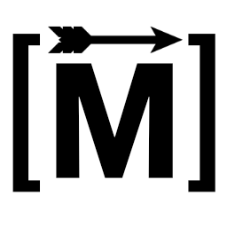
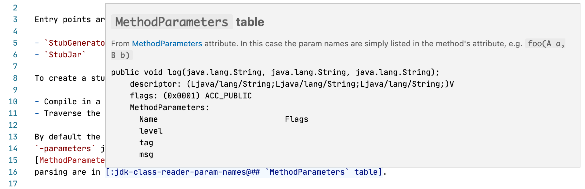
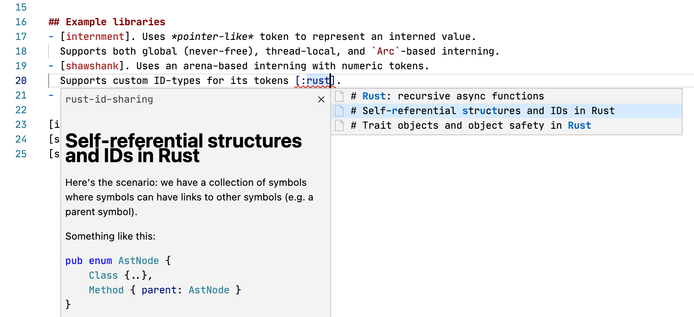
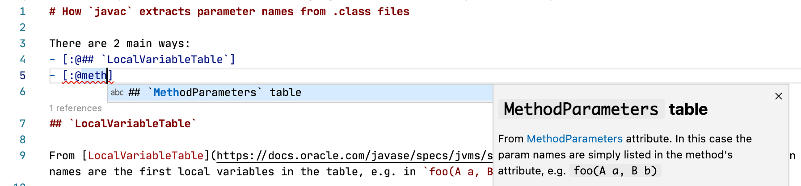
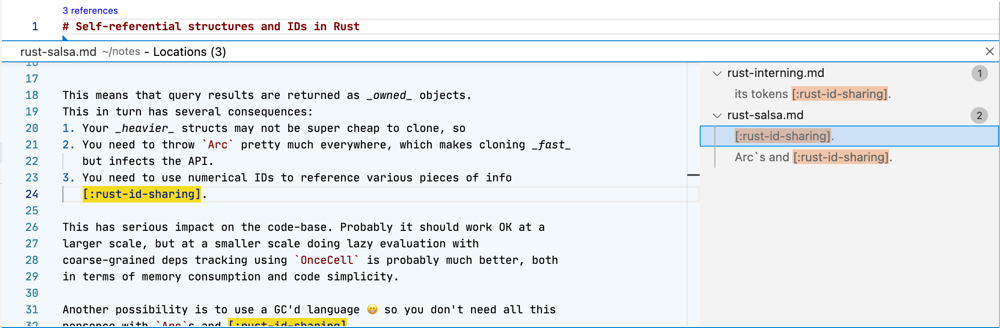
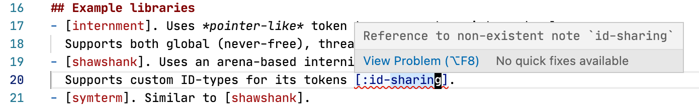

# Marksman

_Markdown LSP server for note-taking and more._

**OBLIGATORY DISCLAIMER:**
Marksman is a _work-in-progress_. For me it works fine, but there wasn't
much testing and stability in general isn't guaranteed.

---

Marksman is an LSP server that helps you write and manage your Markdown notes. The
primary focus is to support [Zettelkasten-like][zettel-wiki][1](#fn1), [2](#fn2) note
taking by providing an easy way to **cross-reference notes**. See more about
Marksman's features below.

But you don't have to go all-in on Zettelkasten to get value out of Marksman:

1. Write your notes that way you like.
2. Cross-reference notes using _reference_ links in a _wiki-link_ format:
    - `[[another-note]]` - a reference to another note.
    - `[[another-note#Section]]` - a reference to a section of a note.
    - `[[#Inner subsection]]` - a reference to a section of the current note.

   Auto-completion provided by Marksman makes this process quick and easy.
3. **Go To Definition**, **Hover** preview, **Code Lenses**, and
   **Diagnostics** simplify navigating and maintaining notes.

## Existing editor integrations[3](#fn3):

- VSCode via [Marksman VSCode][mn-vscode].
- (**TODO**: _needs updating_) Neovim 0.5+
  via [nvim-lspconfig](https://github.com/neovim/nvim-lspconfig/blob/master/CONFIG.md#zeta_note).
- (**TODO**: _needs upstreaming_) Emacs via Emacs LSP.

## How to install

### Option 1: use pre-built binary

1. Go to [Releases](https://github.com/artempyanykh/marksman/releases) page: each release has pre-built binaries for
   Linux, MacOS, and Windows. Download the binary for your OS.
2. Rename the binary and make it executable:
    * MacOS: `mv marksman-macos marksman && chmod +x marksman`
    * Linux: `mv marksman-linux marksman && chmod +x marksman`
    * Windows: rename `marksman-windows.exe` to `marksman.exe`.
3. Place the binary somewhere in your `PATH`.
    * XDG recommends using `$HOME/.local/bin/` (make sure this folder is in your `PATH`).

### Option 2: build from source

0. Install [Dotnet SDK](https://dotnet.microsoft.com/en-us/download) for your OS.
1. Clone the repository: `git clone https://github.com/artempyanykh/marksman.git`
2. Inside `marksman` folder run `make install`
3. The binary will be installed under `$HOME/.local/bin` (make sure this folder is in your `PATH`).

## Screenshots

**TODO**: _This section is outdated. Update with the new screenshots._

- Hover preview:
  
- Completion (note):
  
- Completion (heading):
  
- "Show References" Code Lens:
  
- Project-wide diagnostics for broken references:
  

## Features and plans

✅ - done; 🗓 - planned.

- ✅ Completion for references.
- ✅ Go to Definition for references.
- ✅ Hover prevew for references.
- ✅ Diagnostics about broken references.
- 🗓 Code Lens with "# references" on headings.
- 🗓 Add support for _regular_ links (diagnostics, completion, goto).
- 🗓 Support references in titles.
- ✅ Support multi-folder workspaces.
- ✅ Custom parser for more fine-grained note structure.
- 🗓 Rename refactor.
- 🗓 Support heading slugs.
- 🗓 Add "check" command for standalone workspace checking.
- 🗓 Add "build" command that rewrites all cross-references into proper
  relative markdown links for further embedding into a static site generator
  such as Jekyll or Hakyll.
- 🗓 Add support for images (diagnostics, completion, goto).
- 🗓 Support for Jupyter notebooks.

## Where's `zeta-note` and where's Rust?

After much deliberation, I've decided that it'd be _cheaper_ for me to write a new from-scratch implementation of the
language server **in F#** and add new features to it, than it is to add new features to the Rust version.

The original Rust implementation is archived [in a separate repo][original-zn]. Further development will happen in this
repository in F#.

---

\[1\]: You may have heard about [Roam Research][roam]. This is a commercial
implementation of the Zettelkasten method and another point of reference for
what Marksman is about. However, unlike a proprietary Roam Research, Zeta
Note is free, open-source and integrated into your favourite editor (albeit
for not not as feature rich as Roam Research).

\[2\]: There is an excellent VSCode extension called [Markdown
Memo][md-memo]. You definitely need to check it out if you're primarily using
VSCode as it has some features that are missing in Marksman and [Marksman
VSCode extension][mn-vscode]. However, Markdown Memo is VSCode specific while
Marksman is a generic language server, so can be used with any editor that
has LSP support: Emacs, Vim, Neovim, etc.

\[3\]: Since Marksman is a regular Language Server most of the functionality
works out of the box with any LSP client. The only thing that requires custom
handling is "Code Lenses" due to how these are defined in the LSP spec.

[zettel-wiki]: https://en.wikipedia.org/wiki/Zettelkasten

[roam]: https://roamresearch.com

[md-memo]: https://github.com/svsool/vscode-memo

[mn-vscode]: https://github.com/artempyanykh/marksman-vscode

[original-zn]: https://github.com/artempyanykh/zeta-note