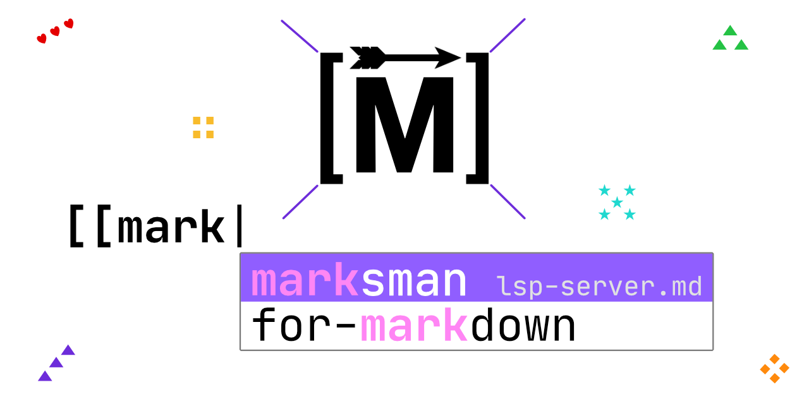

[](https://github.com/artempyanykh/marksman/actions/workflows/build.yml)
[](https://github.com/artempyanykh/marksman/releases)
[](https://formulae.brew.sh/formula/marksman)
[](https://snapcraft.io/marksman)
[](https://github.com/artempyanykh/marksman/releases)

# Marksman

_Write Markdown with code assist and intelligence in the comfort of your favourite editor._



---

Marksman is a program that integrates with your editor to assist you in writing and maintaining your Markdown documents.
Using [LSP protocol][lsp-main] it provides **completion**, goto **definition**, find **references**, **rename**
refactoring, **diagnostics**, and more. In addition to regular Markdown, it also supports **wiki-link**-style references
that enable [Zettelkasten-like][zettel-wiki][^roam-research]<sup>,</sup> [^markdown-memo] note taking. See more about Marksman's
features below.

Marksman **works on MacOS, Linux, and Windows** and is distributed as a **self-contained binary** for each OS.

The server provides assistance with:

* Markdown inline links:
   ```md
   This is [inline link](/some-file.md#some-heading).
   This is an internal [anchor link](#heading).
   ```
* Markdown reference links:
   ```md
   See [reference].

   [reference]: /url "Title"
   ```
* Wiki-links:
   ```md
   Link to [[another-note]].
   Link to [[another-notes#heading]].
   Internal link to [[#a-heading]].
   ```

All types of links support completion, hover, goto definition/references. Additionally, Marksman provides diagnostics
for wiki-links to detect broken references and duplicate/ambiguous headings.

## Existing editor integrations[^lsp]:

* VSCode via [Marksman VSCode][mn-vscode].
* Neovim:
    * via [mason.nvim][mason-nvim] (automatic server installation) (requires [mason-lspconfig.nvim][mason-nvim-lsp-config])
    * via [nvim-lspconfig][nvim-marksman],
    * via [CoC-marksman][coc-marksman].
* Vim:
    * via [ale](ale) - Ale has built-in support for Marksman

    * via [lsp](lsp)

      Example config (add the following to your `~/.vim/after/ftplugin/markdown.vim`):

      ```viml
      if exists('g:loaded_lsp')
        call LspAddServer([#{ name: 'marksman', filetype: ['markdown'], path: '/path/to/marksman', args: ['server'], syncInit: v:true }])
      end
      ```

* Emacs:
    * via [LSP Mode](https://emacs-lsp.github.io/lsp-mode/page/lsp-marksman/) (automatic server installation).

      Example config for `use-package` users:

      ```lisp
      (use-package markdown-mode
        :hook (markdown-mode . lsp)
        :config
        (require 'lsp-marksman))
      ```
    * via [Eglot][eglot], requires configuration (unless
      [eglot#1013][eglot-marksman-pr] gets merged); add the following to your
      `init.el`

      ```lisp
      (add-to-list 'eglot-server-programs '(markdown-mode . ("marksman")))
      (add-hook 'markdown-mode-hook #'eglot-ensure)
      ```
* [Helix](https://helix-editor.com/) supports Marksman out of the box. However, you need add `marksman` binary to
  your `PATH` manually.
* [Kakoune](https://kakoune.org/) can be used with [kakoune-lsp](https://github.com/kakoune-lsp/kakoune-lsp) with
  no other configuration.
* Sublime Text via [LSP-marksman][sublime-marksman] (automatic server
  installation).
* BBEdit [can be configured](https://github.com/artempyanykh/marksman/discussions/206#discussioncomment-5906423) to use Marksman as an LSP server for Markdown files.
* [Zed](https://zed.dev/) supports Marksman through it's integrated LSP support,
  by addinging it as an available LSP for Markdown in Zed's `settings.json`:
  
  ```jsonc
  // Zed settings
  {
    // ...
    "languages": {
      "Markdown": {
        "language_servers": ["marksman"]
      }
    }
  }

  ```

## How to install

See the [installation instructions](/docs/install.md).

## Demos and tutorials

* See [this page](/docs/demo.md) for a mix of Neovim, VSCode, and Emacs screen captures.
* See [this post](https://medium.com/@chrisatmachine/lunarvim-improve-markdown-editing-with-marksman-739d06c73a26)
  on how to use Marksman with [LunarVim](https://www.lunarvim.org).
* Check out [this YouTube video](https://www.youtube.com/watch?v=8GQKOLh_V5E)
  by Luke Pighetti on how to use Marksman with Helix.


## Features

See [the Features page](/docs/features.md) to learn more about language features, configurations, and single- and multi-file modes.

## FAQ

* Cross-file references and completions don't work.
    + Either create an empty `.marksman.toml` in the root folder of your project or initialize a repository (e.g. `git init`). See [this page](/docs/features.md#workspace-folders-project-roots-and-single-file-mode) to learn more about single- and mult-file modes.
* I'm getting "marksman can’t be opened because Apple cannot check it for malicious software" on MacOS.
    + Run the following command to bypass it and let Mac know that it's fine: `xattr -d com.apple.quarantine <path-to-marksman-bin>`.

[^roam-research]: You may have heard about [Roam Research][roam]. That is a commercial implementation of the
Zettelkasten method and another point of reference for what Marksman is about. However, unlike a proprietary Roam
Research, Marksman is free, open-source and integrated into your favourite editor (albeit for not not as feature rich as
Roam Research).

[^markdown-memo]: There is an excellent VSCode extension called [Markdown Memo][md-memo]. You definitely need
to check it out if you're primarily using VSCode as it has some features that are missing in Marksman and [Marksman
VSCode extension][mn-vscode]. However, Markdown Memo is VSCode specific while Marksman is a generic language server, so
can be used with any editor that has LSP support: Emacs, Vim, Neovim, etc.

[^lsp]: Since Marksman is a regular Language Server most of the functionality works out of the box
with any LSP client.

[^single-file-mode]: There is an initiative to add a single-file mode to
LSP but it's not a part of the spec at least until and including v3.17.

[zettel-wiki]: https://en.wikipedia.org/wiki/Zettelkasten

[roam]: https://roamresearch.com

[md-memo]: https://github.com/svsool/vscode-memo

[mn-vscode]: https://github.com/artempyanykh/marksman-vscode

[original-zn]: https://github.com/artempyanykh/zeta-note

[nvim-marksman]: https://github.com/neovim/nvim-lspconfig/blob/master/doc/configs.md#marksman

[mason-nvim]: https://github.com/williamboman/mason.nvim

[mason-nvim-lsp-config]: https://github.com/williamboman/mason-lspconfig.nvim

[lsp-main]: https://microsoft.github.io/language-server-protocol/

[helix-editor]: https://helix-editor.com

[helix-marksman-pr]: https://github.com/helix-editor/helix/pull/3499

[coc-marksman]: https://github.com/yaegassy/coc-marksman

[eglot]: https://github.com/joaotavora/eglot

[eglot-marksman-pr]: https://github.com/joaotavora/eglot/pull/1013

[sublime-marksman]: https://github.com/sublimelsp/LSP-marksman

[ale]: https://github.com/dense-analysis/ale
