[](https://github.com/artempyanykh/marksman/actions/workflows/build.yml)


# Marksman

_Markdown LSP server providing completion, goto, references, diagnostics, and more._


---

Marksman is an LSP server for Markdown that provides **completion**, goto **definition**, find **references**,
**diagnostics**, etc. It also supports **wiki-link**-style references that enable
[Zettelkasten-like][zettel-wiki]<sup>[1](#fn1), [2](#fn2)</sup> note taking. See more about Marksman's features below.

Marksman **works on MacOS, Linux, and Windows** and is distributed as a **self-contained binary** for each OS.

The server provides assistance with:
* Markdown inline links:
   ```md
   This is [inline link](/some-file.md#some-heading).
   This is an internal [anchor link](#heading).
   ```
* Markdown reference links:
   ```md
   See [reference].

   [reference]: /url "Title"
   ```
* Wiki-links:
   ```md
   Link to [[another-note]].
   Link to [[another-notes#heading]].
   Internal link to [[#a-heading]].
   ```

All types of links support completion, hover, goto definition/references. Additionally, Marksman provides diagnostics
for wiki-links to detect broken references and duplicate/ambiguous headings.

## Existing editor integrations<sup>[3](#fn3)</sup>:

- VSCode via [Marksman VSCode][mn-vscode].
- Neovim:
  - via [nvim-lsp-installer][nvim-marksman-lsp-installer] (automatic server installation),
  - via [nvim-lspconfig][nvim-marksman].
- (**TODO**: _needs upstreaming_) Emacs via Emacs LSP.

## How to install

### Option 1: use pre-built binary

1. Go to [Releases](https://github.com/artempyanykh/marksman/releases) page: each release has pre-built binaries for
   Linux, MacOS, and Windows. Download the binary for your OS.
2. Rename the binary and make it executable:
    * MacOS: `mv marksman-macos marksman && chmod +x marksman`
    * Linux: `mv marksman-linux marksman && chmod +x marksman`
    * Windows: rename `marksman-windows.exe` to `marksman.exe`.
3. Place the binary somewhere in your `PATH`.
    * XDG recommends using `$HOME/.local/bin/` (make sure this folder is in your `PATH`).

### Option 2: build from source

0. Install [Dotnet SDK](https://dotnet.microsoft.com/en-us/download) for your OS.
1. Clone the repository: `git clone https://github.com/artempyanykh/marksman.git`
2. Inside `marksman` folder run `make install`
3. The binary will be installed under `$HOME/.local/bin` (make sure this folder is in your `PATH`).

## Screenshots

Below is a mix of VSCode, Neovim, and Emacs screenshots. Although, not all features demonstrated for each editor,
generally most features should work equaly in all editors.

- **Document symbols**:
  * Emacs:
    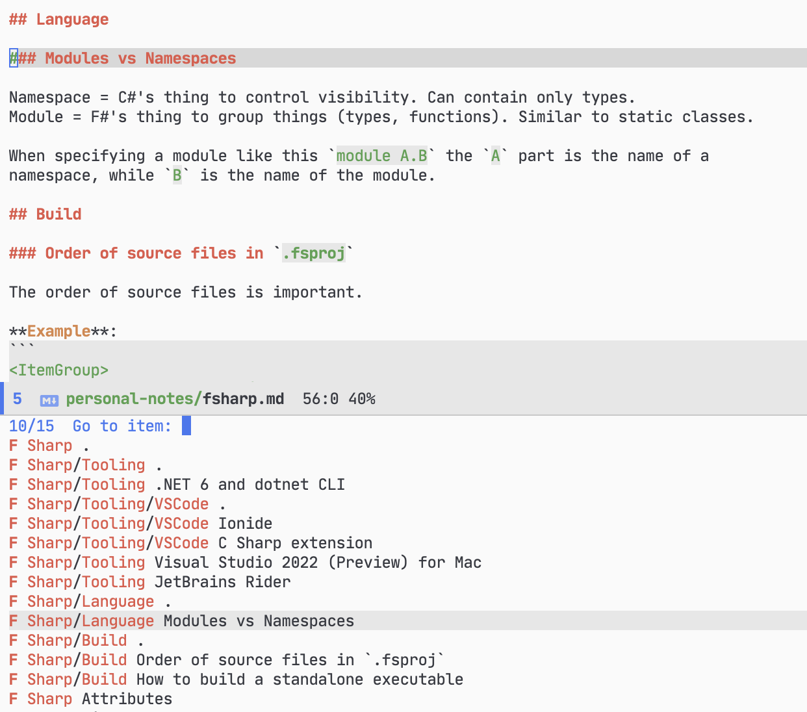
- **Hover preview**:
  * VSCode, wiki link:
    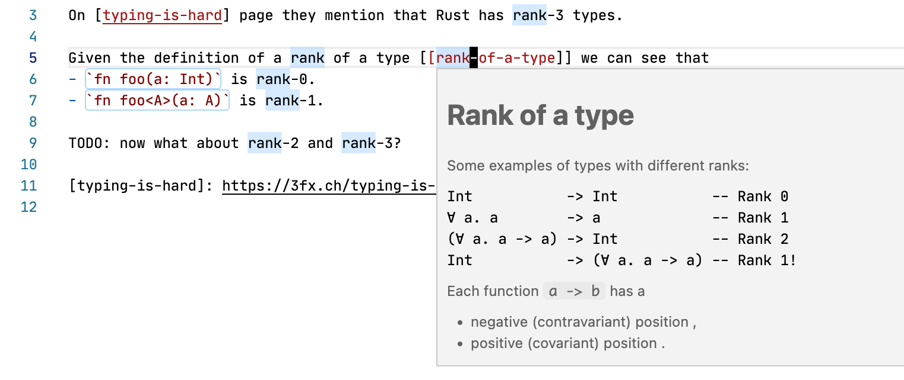
  * Neovim, wiki link:
    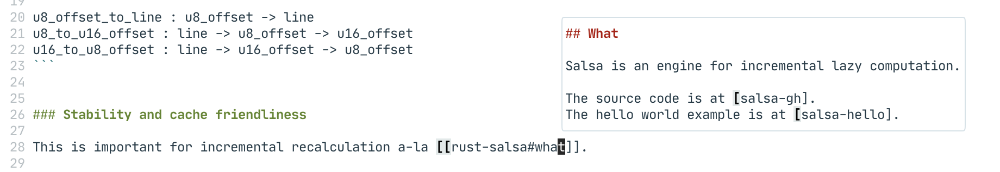
  * Neovim, reference link:
    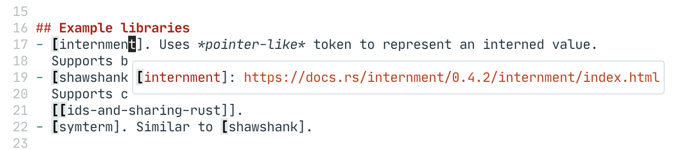
- **Completion**:
  * VSCode, wiki link:
    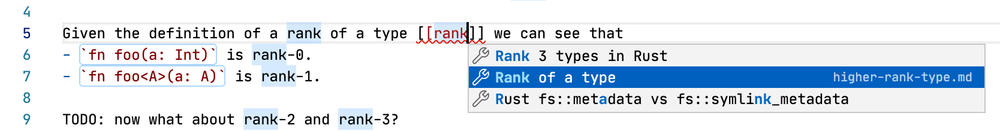
  * VSCode, wiki link heading:
    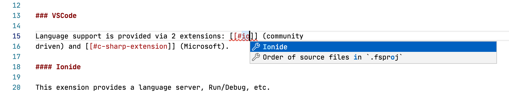
  * VSCode, reference link:
    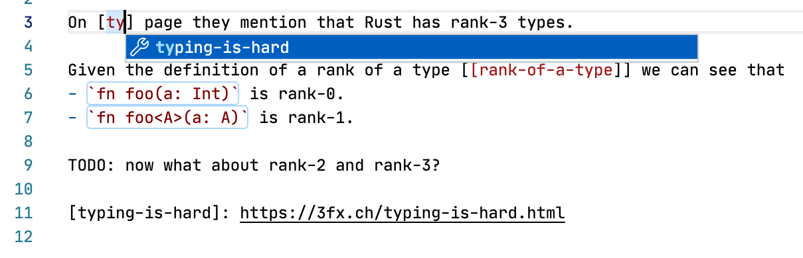
  * Neovim, inline link:
    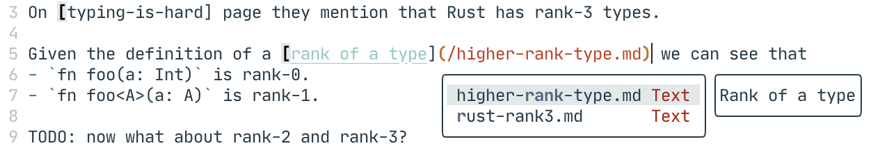
  * Neovim, inline anchor link:
    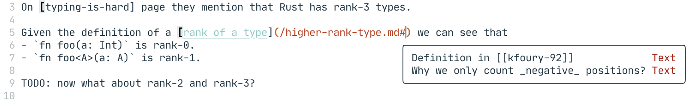
  * Neovim, wiki link heading:
    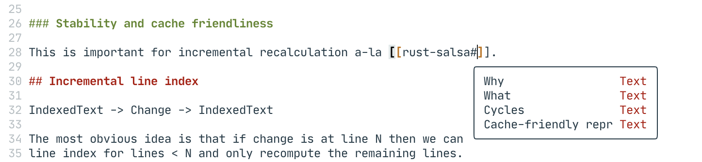
- **Find references**:
  * VSCode:
    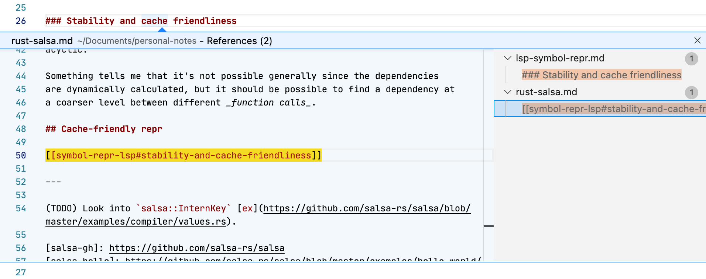
  * Neovim:
    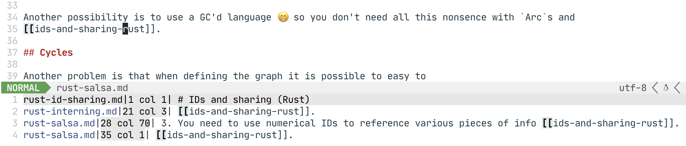
- **Project-wide diagnostics**:
  * VSCode:
    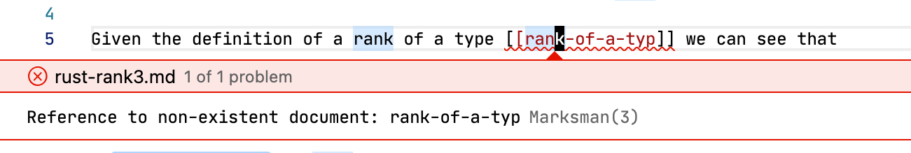
  * Neovim:
    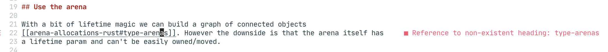

## Features and plans

✅ - done; 🗓 - planned.

- ✅ Completion for links (inline, reference, wiki).
- ✅ Hover prevew for links.
- ✅ "Go to definition" for links.
- ✅ "Find references" for headings and links.
- ✅ Diagnostics for wiki-links.
- ✅ Support multi-folder workspaces.
- ✅ Custom parser for more fine-grained note structure.
- 🗓 Code Lens with "# references" on headings.
- 🗓 Rename refactor.
- 🗓 Add support for images (diagnostics, completion, goto).
- 🗓 Add "check" command for standalone workspace checking.
- 🗓 Add "build" command that rewrites all cross-references into proper
  relative markdown links for further embedding into a static site generator
  such as Jekyll or Hakyll.
- 🗓 Support for Jupyter notebooks.

## Where's `zeta-note` and where's Rust?

After much deliberation, I've decided that it'd be _cheaper_ for me to write a new from-scratch implementation of the
language server **in F#** and add new features to it, than it is to add new features to the Rust version.

The original Rust implementation is archived [in a separate repo][original-zn]. Further development will happen in this
repository in F#.

---

<span id="fn1">\[1\]</span>: You may have heard about [Roam Research][roam]. This is a commercial implementation of the
Zettelkasten method and another point of reference for what Marksman is about. However, unlike a proprietary Roam
Research, Zeta Note is free, open-source and integrated into your favourite editor (albeit for not not as feature rich
as Roam Research).

<span id="fn2">\[2\]</span>: There is an excellent VSCode extension called [Markdown Memo][md-memo]. You definitely need
to check it out if you're primarily using VSCode as it has some features that are missing in Marksman and [Marksman
VSCode extension][mn-vscode]. However, Markdown Memo is VSCode specific while Marksman is a generic language server, so
can be used with any editor that has LSP support: Emacs, Vim, Neovim, etc.

<span id="fn3">\[3\]</span>: Since Marksman is a regular Language Server most of the functionality works out of the box
with any LSP client.

[zettel-wiki]: https://en.wikipedia.org/wiki/Zettelkasten

[roam]: https://roamresearch.com

[md-memo]: https://github.com/svsool/vscode-memo

[mn-vscode]: https://github.com/artempyanykh/marksman-vscode

[original-zn]: https://github.com/artempyanykh/zeta-note

[nvim-marksman]: https://github.com/neovim/nvim-lspconfig/blob/master/doc/server_configurations.md#marksman
[nvim-marksman-lsp-installer]: https://github.com/williamboman/nvim-lsp-installer
