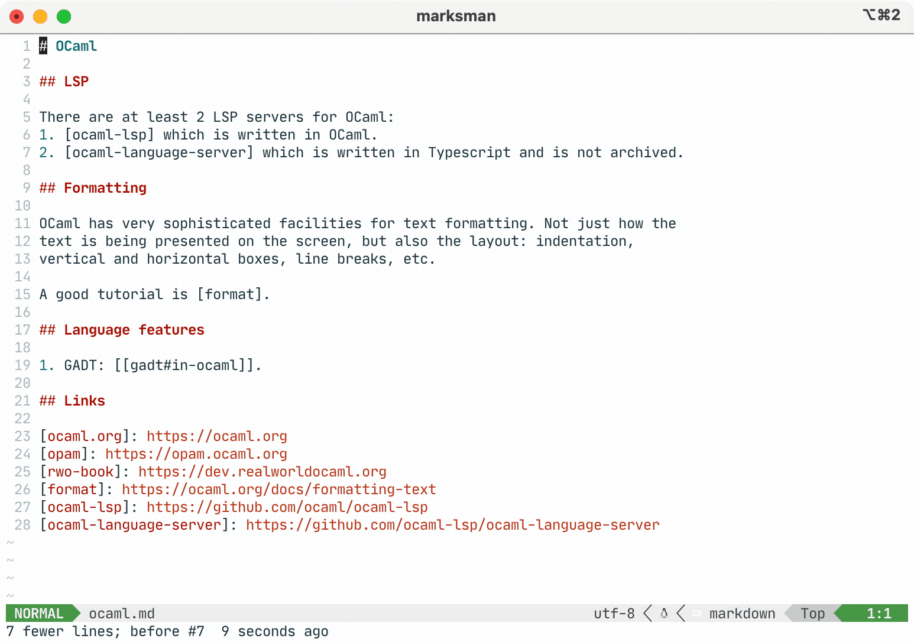

[](https://github.com/artempyanykh/marksman/actions/workflows/build.yml)


# Marksman

_Write Markdown with code assist and intelligence in the comfort of your favourite editor._


---

Marksman is a program that integrates with your editor to assist you in writing and maintaining your Markdown documents.
Using [LSP protocol][lsp-main] it provides **completion**, goto **definition**, find **references**, **rename**
refactoring, **diagnostics**, and more. In addition to regular Markdown, it also supports **wiki-link**-style references
that enable [Zettelkasten-like][zettel-wiki][^roam-research], [^markdown-memo] note taking. See more about Marksman's
features below.

Marksman **works on MacOS, Linux, and Windows** and is distributed as a **self-contained binary** for each OS.

The server provides assistance with:

* Markdown inline links:
   ```md
   This is [inline link](/some-file.md#some-heading).
   This is an internal [anchor link](#heading).
   ```
* Markdown reference links:
   ```md
   See [reference].

   [reference]: /url "Title"
   ```
* Wiki-links:
   ```md
   Link to [[another-note]].
   Link to [[another-notes#heading]].
   Internal link to [[#a-heading]].
   ```

All types of links support completion, hover, goto definition/references. Additionally, Marksman provides diagnostics
for wiki-links to detect broken references and duplicate/ambiguous headings.

## Existing editor integrations[^lsp]:

* VSCode via [Marksman VSCode][mn-vscode].
* Neovim:
    * via [mason.nvim][mason-nvim] (automatic server installation) (
      Requires [mason-lspconfig.nvim][mason-nvim-lsp-config])
    * via [nvim-lspconfig][nvim-marksman],
    * via [CoC-marksman][coc-marksman].
* Emacs:
    * via [LSP Mode](https://emacs-lsp.github.io/lsp-mode/page/lsp-marksman/) (automatic server installation).

      Example config for `use-package` users:

      ```lisp
      (use-package markdown-mode
        :hook (markdown-mode . lsp)
        :config
        (require 'lsp-marksman))
      ```
    * via [Eglot][eglot], requires configuration (unless
      [eglot#1013][eglot-marksman-pr] gets merged); add the following to your
      `init.el`

      ```lisp
      (add-to-list 'eglot-server-programs '(markdown-mode . ("marksman")))      
      (add-hook 'markdown-mode-hook #'eglot-ensure)
      ````
* [Helix](https://helix-editor.com/) supports Marksman out of the box. However, you need add `marksman` binary to
  your `PATH` manually.
* Sublime Text via [LSP-marksman][sublime-marksman] (automatic server
  installation).

## How to install

### Option 1: use pre-built binary

1. Go to [Releases](https://github.com/artempyanykh/marksman/releases) page: each release has pre-built binaries for
   Linux, MacOS, and Windows. Download the binary for your OS.
2. Rename the binary and make it executable:
    * MacOS: `mv marksman-macos marksman && chmod +x marksman`
    * Linux: `mv marksman-linux marksman && chmod +x marksman`
    * Windows: rename `marksman-windows.exe` to `marksman.exe`.
3. Place the binary somewhere in your `PATH`.
    * XDG recommends using `$HOME/.local/bin/` (make sure this folder is in your `PATH`).

**NOTE**: If you're on MacOS and are getting a popup about:

> “marksman” can’t be opened because Apple cannot check it for malicious software...

Then you can run the following command to bypass it and let Mac know that it's
fine:

```sh
xattr -d com.apple.quarantine <path-to-marksman-bin>
```

### Option 2: build from source

0. Install [Dotnet SDK](https://dotnet.microsoft.com/en-us/download) for your OS.
1. Clone the repository: `git clone https://github.com/artempyanykh/marksman.git`
2. Inside `marksman` folder run `make install`
3. The binary will be installed under `$HOME/.local/bin` (make sure this folder is in your `PATH`).

### Option 3: use a package manager

* Homebrew, for Linux and MacOS:

```bash
brew install marksman
```

### NixOS

`marksman` is available via `nixpkgs`. Currently, it's only available on the `master` branch. You can add it via 

```
$ nix-channel --add https://github.com/NixOS/nixpkgs/archive/master.tar.gz nixpkgs-master
```

In your config import the channel at the top 

```nix 
{ pkgs, ... }:
let 
  masterpkgs = import <nixpkgs-master> {};
in 
{
 # ...
 # just a simple system wide installation example
 # ...
  environment.systemPackages = [
    masterpkgs.marksman
  ];
 # ...
}
```

In the future, it'll be available via the `unstable` channel and eventually via the `stable` channel.

## Demo

Below is a mix of VSCode, Neovim, and Emacs screenshots. Although, not all features demonstrated for each editor,
generally most features should work equaly in all editors.

- **Document symbols**:
  
- **Hover preview**:
  
- **Completion**:
    * 
    * 
- **Find references**:
  
- **Project-wide diagnostics**:
  
- **Rename refactor for headings and reference links**:
  

## Features

✅ - done; 🗓 - planned.

- ✅ Document symbols from headings.
- ✅ Workspace symbols from headings.
    * Query matching is subsequence-based, that is `lsp` will match both `LSP` and `Low Seismic Profile`.
- ✅ Completion for links (inline, reference, wiki).
- ✅ Hover prevew for links.
- ✅ "Go to definition" for links.
- ✅ "Find references" for headings and links.
- ✅ Diagnostics for wiki-links.
- ✅ Support multi-folder workspaces.
- ✅ Custom parser for more fine-grained note structure.
- 🗓 Code Lens with "# references" on headings.
- ✅ Rename refactor.
- 🗓 Add support for images (diagnostics, completion, goto).
- 🗓 Add "check" command for standalone workspace checking.
- 🗓 Add "build" command that rewrites all cross-references into proper
  relative markdown links for further embedding into a static site generator
  such as Jekyll or Hakyll.
- 🗓 Support for Jupyter notebooks.

### Configuration

See [Configuration](docs/configuration.md) docs for more details.

### Wiki links

Alongside regular markdown links, Marksman also supports wiki-style links, e.g. ``[[some-doc]]``
or ``[[#some-heading]]``. This is particularly convenient when working with a Zettelkasten-like repository of markdown
notes, as it streamlines linking and cross-linking of notes. This is what tool like [Obsidian][obsidian]
and [Emanote][emanote] use.

By default Marksman uses a document **title's slug** when referencing a document, however there is an configuration
setting to use a **file name** or a file path instead. This functionality is currently **experimental** and may change
in future depending on user's feedback. See [Configuration](docs/configuration.md) for more details.

### Code actions

Code actions usually can be enabled/disabled via a configuration option. See
[configuration](#configuration) for more details.

#### Table of Contents

Marksman has a code action to create and update a table of contents of a document.



### Ignore files

Marksman by default reads ignore globs from `.gitignore`, `.hgignore`, and
`.ignore` and doesn't scan directories matching any of the glob patterns.
Marksman will search for and read ignore files in all sub-folders of the
workspace. similarly to what Git does.

### Workspace folders, project roots, and single-file mode

The LSP specification is designed to work with projects rather than individual
files[^single-file-mode]. Marksman has a custom **single-file mode** that
provides a *subset* of language features for markdown files open outside of any
project. This works well for small one-off edits or when opening random
markdown files. However, when you have several interconnected documents do
consider setting up a project folder for them for an improved experience.

How a folder (aka project, aka root) is found varies between editors, but
usually it's either

1. a root of a VCS repository (applicable to all languages),
2. a folder with `.marksman.toml` marker file (specific to Marksman
   integrations).

When Marksman doesn't provide cross-file language assist for your files and you
don't understand why, you can either:

1. check your project into version control, or
2. create a `.marksman.toml` at the root folder of your project, or
3. refer to your editor/LSP client documentation regarding how a project root
   is defined.

## Where's `zeta-note` and where's Rust?

After much deliberation, I've decided that it'd be _cheaper_ for me to write a new from-scratch implementation of the
language server **in F#** and add new features to it, than it is to add new features to the Rust version.

The original Rust implementation is archived [in a separate repo][original-zn]. Further development will happen in this
repository in F#.


[^roam-research]: You may have heard about [Roam Research][roam]. That is a commercial implementation of the
Zettelkasten method and another point of reference for what Marksman is about. However, unlike a proprietary Roam
Research, Marksman is free, open-source and integrated into your favourite editor (albeit for not not as feature rich as
Roam Research).

[^markdown-memo]: There is an excellent VSCode extension called [Markdown Memo][md-memo]. You definitely need
to check it out if you're primarily using VSCode as it has some features that are missing in Marksman and [Marksman
VSCode extension][mn-vscode]. However, Markdown Memo is VSCode specific while Marksman is a generic language server, so
can be used with any editor that has LSP support: Emacs, Vim, Neovim, etc.

[^lsp]: Since Marksman is a regular Language Server most of the functionality works out of the box
with any LSP client.

[^single-file-mode]: There is an initiative to add a single-file mode to
LSP but it's not a part of the spec at least until and including v3.17.

[zettel-wiki]: https://en.wikipedia.org/wiki/Zettelkasten

[roam]: https://roamresearch.com

[md-memo]: https://github.com/svsool/vscode-memo

[mn-vscode]: https://github.com/artempyanykh/marksman-vscode

[original-zn]: https://github.com/artempyanykh/zeta-note

[nvim-marksman]: https://github.com/neovim/nvim-lspconfig/blob/master/doc/server_configurations.md#marksman

[mason-nvim]: https://github.com/williamboman/mason.nvim

[mason-nvim-lsp-config]: https://github.com/williamboman/mason-lspconfig.nvim

[lsp-main]: https://microsoft.github.io/language-server-protocol/

[helix-editor]: https://helix-editor.com

[helix-marksman-pr]: https://github.com/helix-editor/helix/pull/3499

[coc-marksman]: https://github.com/yaegassy/coc-marksman

[eglot]: https://github.com/joaotavora/eglot

[eglot-marksman-pr]: https://github.com/joaotavora/eglot/pull/1013

[sublime-marksman]: https://github.com/bitsper2nd/LSP-marksman

[obsidian]: https://obsidian.md

[emanote]: https://emanote.srid.ca
